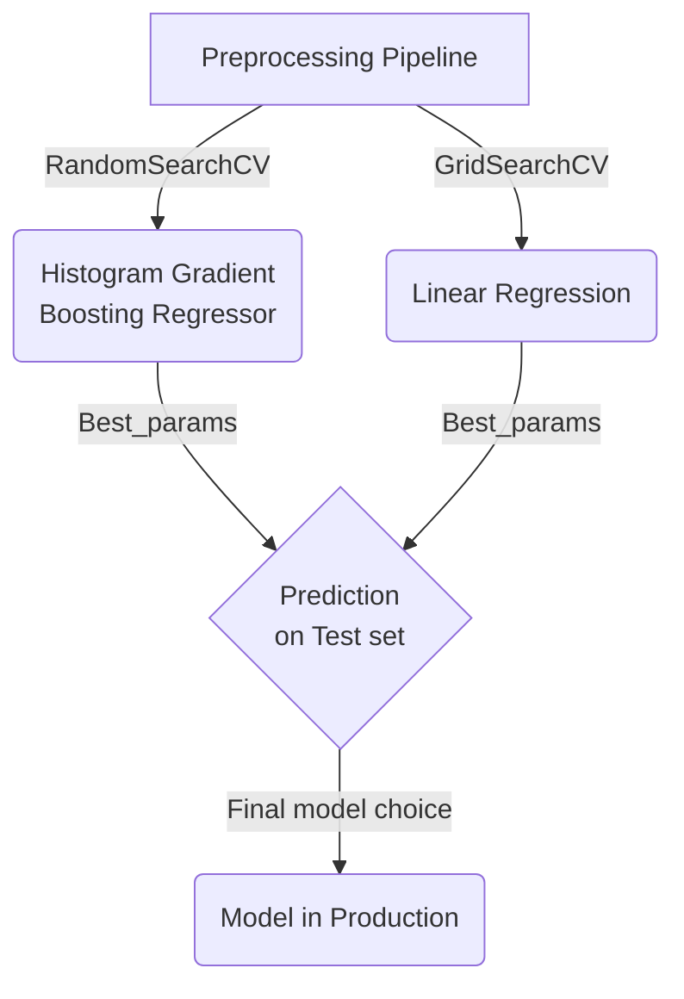

# Dyson Technical Challenge

## **A. Overview**
This submission consists of the following sections:

1. Dyson.ipynb file - Main submission
2. Simple web frontend - Consisting of files in docker, models and src folders

Please unpack the zip file and cd into location. This location will be refered to in this documentation as `<base>`.

---
## **B. Folder Structure**

The following shows the folder structure of the repository. 

```bash
  <base>
    ├── .env              # Required to use for mapbox api in Jupyter
    ├── dyson.ipynb       # Jupyter Notebook
    ├── conda-env.yaml    # conda env file for Jupyter Notebook
    ├── readme.md      
    ├── data
    │   └── cali_dyson_households.csv  # Provided data file
    ├── docker
    │   ├── ces.DockerFile             # dockerfile
    │   ├── docker-compose.yml         # docker-compose file
    │   └── requirements.txt           # env file for dockerfile
    ├── models
    │   └── lin_reg_pipe.pkl           # pickled file for use in frontend
    └── src
        └── app.py                     # frontend script
```
---
## **C. Instructions** 

Unless otherwise stated please use run the following commands on the command line at `<base>`. Please see [folder structure](#folder-structure) for more information.

### **C.1. Running Jupyter Notebook**
1.1 To run the other sections please use the conda-env.yaml file, using the command:
```bash
conda env create -f conda-env.yaml
conda activate ces
```

### **C.2. Running Front-End**
2.1 To run streamlit via docker, please use the command:
  ```bash
  docker compose -f docker/docker-compose.yml up -d
  ```

2.2 Once the image has been sucessfully created you can access the frontend on your browser at `localhost:6006`

2.3 To stop the container, please use the command:
  ```bash
  docker-compose -f docker/docker-compose.yml down 
  ```

---
## **D. Model pipeline**

To help better understand the overall flow of the ML pipeline please view the following to understand the Machine Learning process flow.



---