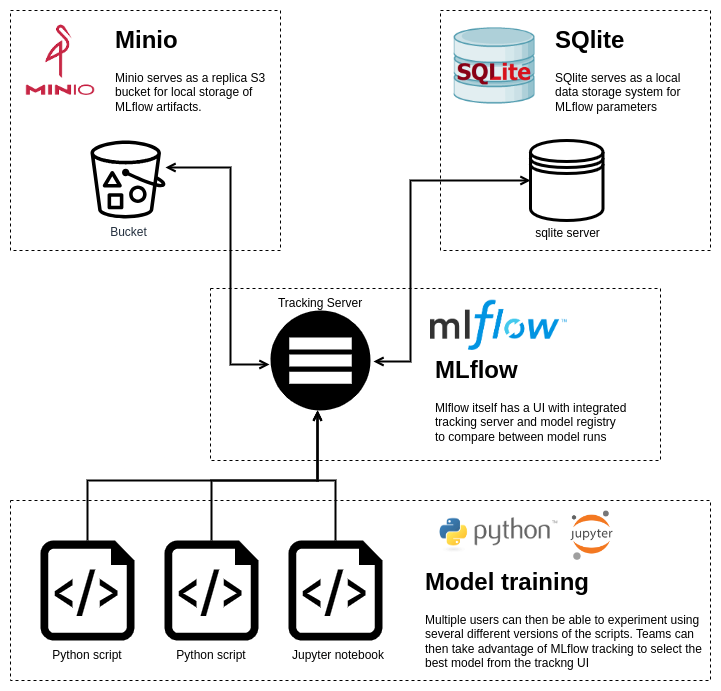
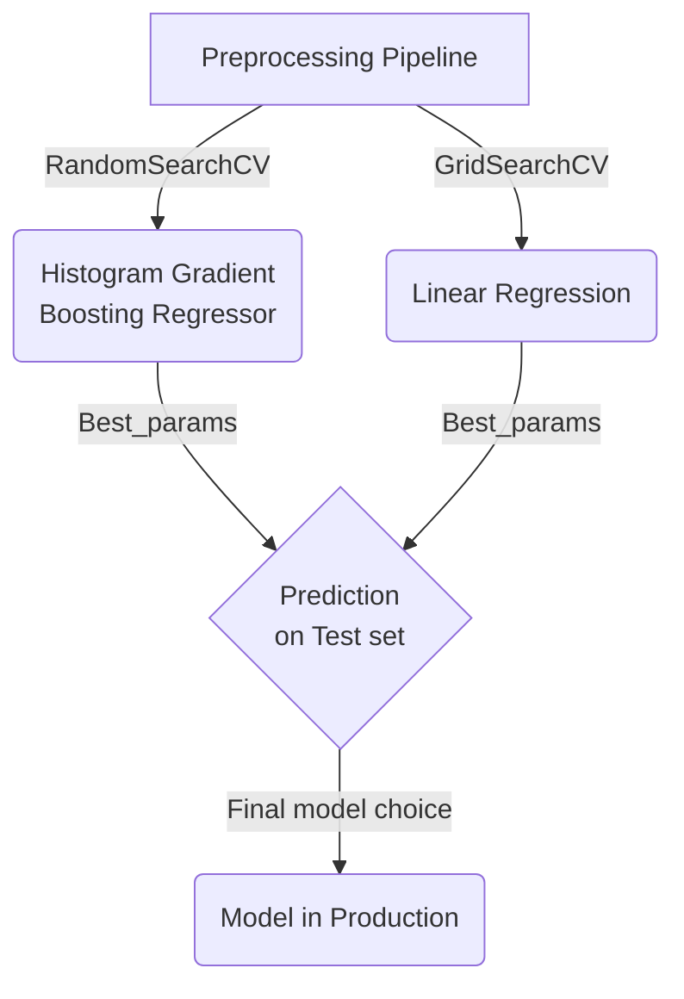

# Customer Experience Survey Prediction

## **A. Overview**
The aim of this notebook is to demonstrate a workable MLOps solution to allow for team level collaboration between teams of data scientist and ML engineers.

The objective of the 

---
### **A.1 Why is Model Tracking Necessary**
With AI at an inflection point and gaining increasing scale. It is necessary to allow teams of Data Scientists and ML engineers to work together. However, when it comes to large teams, the task of tracking and comparing multiple experiment runs across different users is a tedious task without the necessary infrastructure.

Hence, the use of MLFlow and its associated parts allows the data science team to quickly scale up and leverage work across the different teams quickly.

### **A.2 Parts of the stack**

#### **1. MLFlow (Model Tracking and Registry):** 
MLFlow consist of 4 main parts: MLflow tracking, MLflow Projects


For more information regarding MLFlow, please look up MLFlow [documentation](https://mlflow.org/docs/latest/index.html)

#### **2. Minio (Bucket Store):**
After each tracking run, MLFlow assigns a run ID and saves associated run artifcats together for easier retrieval in the future. Minio serves as a way for MLflow to interact with the various saved artifacts.

Instead of a local storage, Minio saves the objects in an S3 like blob store. Being S3 compatible means one only has to change the bucket location to a cloud provider to scale up the entire operation.

For more information regarding MLFlow, please look up Minio [documentation](https://min.io/docs/minio/linux/index.html)

#### **3. SQlite (Parameter and Metric Store):**
Backend database for parameters and metrics for the tracking 





### **A.1 Setting up MLFlow Server and Minio**

To understand 


---
## **B. Folder Structure**

The following shows the folder structure of the repository. 

```bash
  <base>
    ├── .env              # Required to use for mapbox api in Jupyter
    ├── dyson.ipynb       # Jupyter Notebook
    ├── conda-env.yaml    # conda env file for Jupyter Notebook
    ├── readme.md      
    ├── data
    │   └── cali_dyson_households.csv  # Provided data file
    ├── docker
    │   ├── ces.DockerFile             # dockerfile
    │   ├── docker-compose.yml         # docker-compose file
    │   └── requirements.txt           # env file for dockerfile
    ├── models
    │   └── lin_reg_pipe.pkl           # pickled file for use in frontend
    └── src
        └── app.py                     # frontend script
```
---
## **C. Instructions** 

Unless otherwise stated please use run the following commands on the command line at `<base>`. Please see [folder structure](#folder-structure) for more information.

### **C.1. Running Jupyter Notebook**
1.1 To run the other sections please use the conda-env.yaml file, using the command:
```bash
conda env create -f conda-env.yaml
conda activate ces
```

### **C.2. Running Front-End**
2.1 To run streamlit via docker, please use the command:
  ```bash
  docker compose -f docker/docker-compose.yml up -d
  ```

2.2 Once the image has been sucessfully created you can access the frontend on your browser at `localhost:6006`

2.3 To stop the container, please use the command:
  ```bash
  docker-compose -f docker/docker-compose.yml down 
  ```

---
## **D. Model pipeline**

To help better understand the overall flow of the ML pipeline please view the following to understand the Machine Learning process flow.



---
